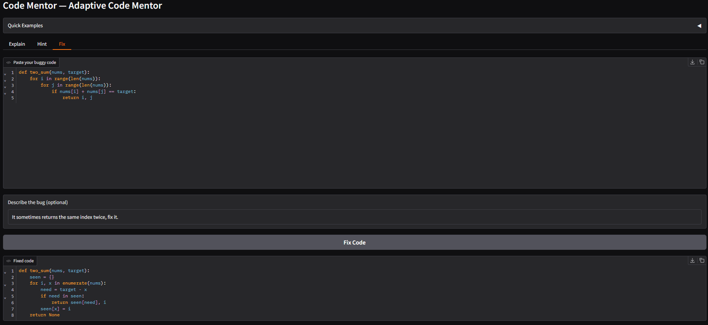
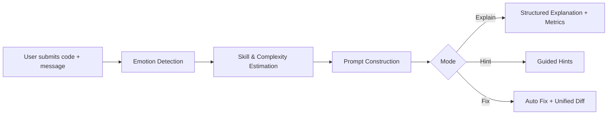

# 🧠 CodeMentor — Adaptive AI Coding Assistant

An AI-powered coding tutor designed to help developers understand, debug, and improve their Python code.  
CodeMentor analyzes your code and message, detects your sentiment, estimates your skill level, measures code complexity, and adapts its explanations, hints, or fixes accordingly.

> 💬 Paste your code → 📊 Analyze sentiment & complexity → 🛠 Get tailored explanations, hints, or automatic fixes.

---

## 🚀 Overview
<p align="left">
  
</p>

<p align="left">
  
</p>

This project is a **Generative AI application** that combines:

- 🧠 **Sentiment Analysis** (DistilBERT) to detect user frustration or confidence.
- 📈 **Skill Estimation** based on message tone and code complexity.
- 🌳 **AST Analysis** to measure structural depth and logical complexity.
- 🧹 **Ruff Static Analysis** to detect linting and style issues.
- 🧩 **Adaptive Prompt Engineering** to tailor responses based on mode, emotion, and skill.

It offers developers a responsive tool for explanation, debugging support, and guided learning.

---

## 🛠 Features

- 🔍 **Explain Mode**
  - Step-by-step breakdown of code logic
  - Complexity and AST depth metrics
  - Skill bucket & sentiment diagnostics

- 💡 **Hint Mode**
  - Guided hints without revealing full solutions
  - Skill-appropriate scaffolding

- 🔧 **Fix Mode**
  - Automatic bug correction (where applicable)
  - Unified diff view showing exact code changes

- 📊 **Diagnostics Panel**
  - Sentiment detection results
  - Skill level estimation
  - Code complexity score
  - Ruff lint results

- 🎯 **Adaptive Response System**
  - Tone adjusts based on detected frustration
  - Detail level adapts to estimated experience

---

## 🧰 Tech Stack

| Component                | Tool / Library                     |
|--------------------------|-------------------------------------|
| Interface                | Gradio                             |
| Emotion Detection        | DistilBERT (fine-tuned)            |
| Skill Estimation         | Custom heuristics + Scikit-learn   |
| Static Analysis          | Ruff + Python `ast`                |
| Backend                  | Python, Torch                      |

---

## ⚙️ Installation

### 🔗 Prerequisites

- Python 3.10+
- (Optional) GPU / MPS for faster inference

### 📦 Setup Steps

```bash
# 1. Clone the repository
git clone https://github.com/<your-username>/code-mentor.git
cd code-mentor

# 2. Create and activate virtual environment
python -m venv .venv
source .venv/bin/activate       # On Windows: .venv\Scripts\activate

# 3. Install dependencies
pip install -r requirements.txt
````

### ▶️ Run the Application

```bash
python -m codementor.app
```

Then open:

```
http://127.0.0.1:7860
```

---

## 📁 Project Structure

```text
├── app.py               # Gradio UI
├── mentor_agent.py      # Prompt building & response logic
├── skill_model.py       # Skill estimation logic
├── emotion.py           # Sentiment detection
├── ast_metrics.py       # AST depth & complexity analysis
├── static_tools.py      # Ruff integration
├── patcher.py           # Auto-fix + unified diff generation
├── utils.py             # Helper functions
├── requirements.txt
└── assets/
    ├── example_output_1.png
    └── example_output_2.png
```

---

## 🔄 Workflow



---

## 💬 Example Use Cases

* Understanding nested loops and algorithm complexity
* Debugging beginner Python assignments
* Learning clean coding practices
* Seeing visual diffs of suggested fixes
* Receiving emotion-aware mentoring when frustrated

---

## 🔮 Future Enhancements

* 🤖 Production LLM API integration
* 🧠 Expanded auto-fix capabilities
* 🌍 Multi-language support
* 📈 Personalized learning tracking
* 🏗 Structured feedback reports

---

## 👤 Author

**Julisa Delfin**
MS Data Science & Artificial Intelligence
DePaul University

[](https://www.linkedin.com/in/julisadelfin/)

```
